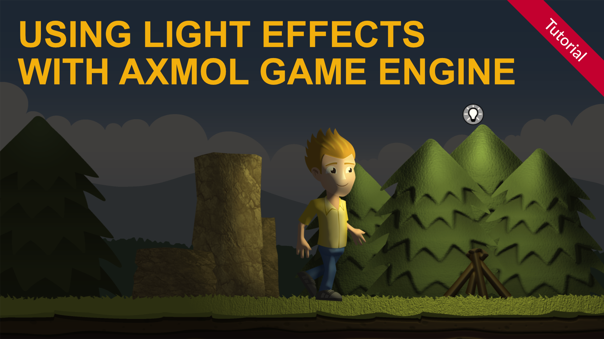

# How to use 2d dynamic light effects in Axmol Game Engine

This is the example code for the Axmol Game Engine 2d light tutorial.

You learn 

- How to create normal mapped sprites
- How to use normal mapped sprites with a shader to create 2d light effects

Read the complete tutorial here:

[How to use 2d dynamic light effects in Axmol Game Engine](https://www.codeandweb.com/spriteilluminator/tutorials/how-to-use-light-effects-with-axmol-game-engine)

